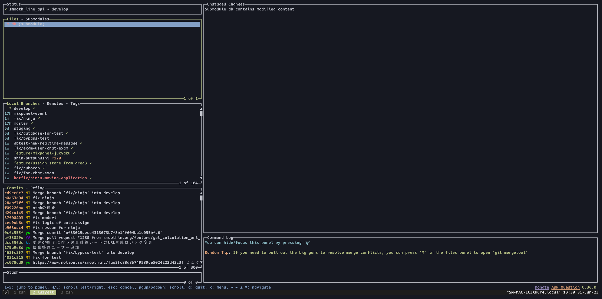
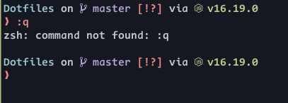

# CLIツールたち
taro morita

---

# tmux
- 昔からあるマルチプレクサ
- terminalのタブとか分割ができる。リモート環境(sshとかでも)可能
- vimmerは結構皆使っているイメージ
- 参考サイト：[tmuxを必要最低限で入門して使う - Qiita](https://qiita.com/shin-ch13/items/9d207a70ccc8467f7bab)
---

# tmuxこんなかんじ


---

# lazygit
- CLIのgitクライアント
- 結構高機能
- [jesseduffield/lazygit: simple terminal UI for git commands](https://github.com/jesseduffield/lazygit)

---
# lazygitこんなかんじ


---
# Starship
- ターミナルをおしゃれにするやつ
- rust製でまあはやい
- [Starship: Cross-Shell Prompt](https://starship.rs/ja-jp/)


---
# Neovim
- 進化したvim
- 最も最強のエディタ
- インスコしろ
```shell
brew install neovim
```

---

# Neovimこんな感じ

